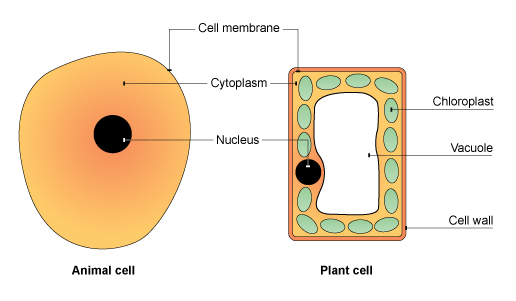
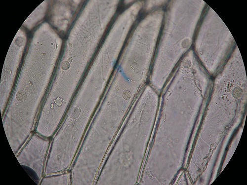

Animal and Plant Cells
-------

*Plant cells* and *animal cells* contain many of the same *organelles* but are different in a few ways: 

1. Plant cells tend to have a rigid regular cells shape while animal cells vary massively.
2. Plants stay in one place; they don't move around.
3. Plants make their food via *photosynthesis*, while animals eat their food, be that meat or plants
4. Plants and animal cells have different features:

|Part	|Function|Found in|
|-----|-----------|----------|
|Cell membrane|Controls what substances can get into and out of the cell.|Plant and animal cells|
|Cytoplasm|Jelly-like substance, where chemical reactions happen.|Plant and animal cells|
|Nucleus|Controls what happens inside the cell and carries genetic information.|Plant and animal cells|
|Chloroplast|Site of photosynthesis – chloroplasts contain a green substance called chlorophyll|Most plant cells|
|Vacuole|Contains a liquid called cell sap, which keeps the cell firm.|Most plant cells and, temporarily, some animal cells|
|Cell wall|Made of cellulose, which supports the cell.|Plant cells only|
|Ribosomes|Where protein synthesis occurs|Plant and animal cells|
|Mitochondria|Site of anaerobic respiration (release energy)|Plant and animal cells|

