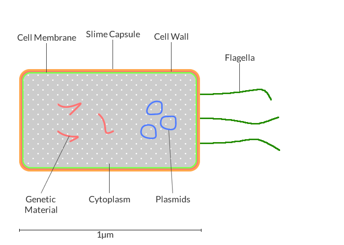
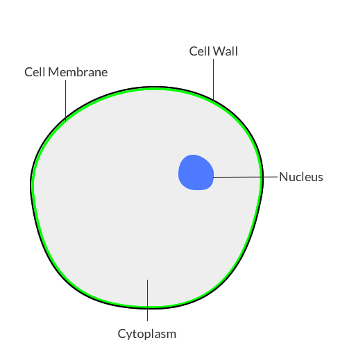

Bacterial and Yeast Cells
-------

##Bacterial Cells

A **bacterium** (plural *bacteri<b>a</b>*) is a single-celled organism that is much smaller than any animal or plant cell. Most bacteria are less than 10µm in length, as such, you are unable to see them without a microscope.    

Some bacteria can cause diseases -- such as *E. coli* -- but most bacteria are harmless. We even use some to make food (yoghurt and cheese) or medicines (penicillin).

##Yeast Cells

**Yeast** is another type of single-celled organism, like bacteria, that vary in size but are around 3-4µm in size. They reproduce asexually and are specifically adapted to anaerobic conditions. When there is little oxygen for them to use in aerobic respiration, they break down sugar to produce ethanol and carbon dioxide, this is *fermentation*. This process has been used by humans for millennia to make alcoholic drinks and bread. 

## Differences and Similarities

|Part	|Function|Found in|
|-----|-----------|----------|
|Genetic material (DNA)|Contains genetic code for the cell|Free flowing in bacteria, in the nucleus of yeast|
|Cell membrane|Controls the passage of chemicals in and out of the cell|Bacteria and yeast|
|Cell wall|Provides rigidity to maintain cell shape|Bacteria and yeast|
|Cytoplasm|The substance in which most chemical reactions take place|Bacteria and yeast|
|Flagella|Long protein to help move the cell|Bacteria only|
|Plasmids|Small circular sections of DNA used to carry extra genetic information|Bacteria only|
|Slime capsule|Protect the bacteria from environmental dangers such as antibiotics and drying out|Bacteria only|
