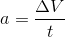

Velocity and Acceleration
-----------

##Velocity

Velocity is a measure of how far an object is travels per unit of time **in a given direction**. The 'given direction' is very important; *how far an object is travels per unit of time* is simply **speed** (think metres/second), while **velocity** tells you the direction of that speed. As such, it is called a **vector quantity**, while speed is called a **scalar quantity** as it only has a magnitude, not a direction.
Velocity would be given with the units of speed *and* a direction, for example:
>5 ms-1 east

##Acceleration
Acceleration is a measure of the *change in speed* of an object. For instance, if you are travelling at a constant speed,  you have no acceleration (0), while if you are getting faster, you are accelerating.  

When you are slowing down, are *decelerating* or you can be said to have a *negative acceleration*.    
Acceleration is given by the units ms-2 or metres per second per second, for example:
>The car is accelerating at 3ms-2

##Practice Questions

1) A car accelerates from 10ms-1 to 30ms-1 in 8 seconds. 
What is its acceleration?

**Answer**: 

The car's velocity is changing from 10ms-1 to 30ms-1, so the change is 20ms-1. It does this in 8 seconds, therefore:   
20ms-1 / 8 = acceleration = 2.5ms-2
